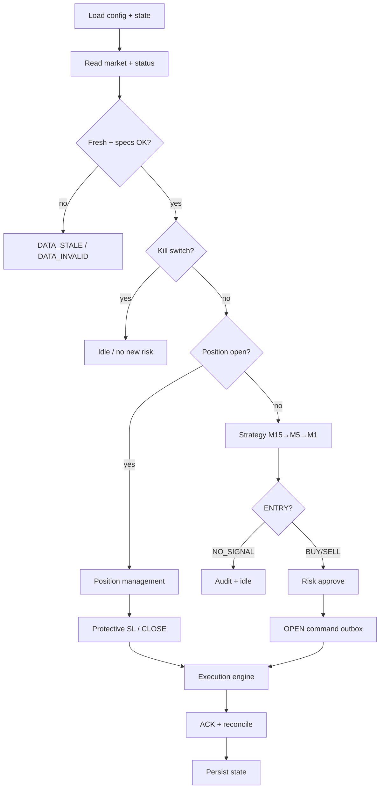

# Architecture — SYSTEM v2.0.0

Clean layered package under `src/checktrader/`. Dependencies point inward: application orchestrates; domain has no I/O; adapters (market, execution, state, dashboard) sit at the edges.

## Package map

| Layer | Package | Responsibility |
|-------|---------|----------------|
| Domain | `domain/` | Enums, money/specs, orders, positions, setup, trailing, errors |
| Application | `application/` | Bootstrap, live loop, cycle orchestration, health / kill switch |
| Config | `config/` | Load + validate `system.json` |
| Market | `market_data/` | Parse market/status, freshness, aggregate M1→M5/M15, indicators, structure |
| Strategy | `strategy/` | `TREND_PULLBACK_BREAK` setup engine + fingerprint |
| Risk | `risk/` | Lot sizing, SL checks, margin gate |
| Position mgmt | `position_management/` | BE, pip grid, high lock, exit pressure, protective selection |
| Execution | `execution/` | Command factory, outbox, ACK parse/validate, reconcile |
| State | `state/` | Persist instance runtime, transitions, recovery |
| Observability | `observability/` | Logging, audit lines, metrics, reason codes |
| Dashboard | `dashboard/` | Read-only local HTTP snapshot + HTML |
| MT4 bridge | `mt4/` + `runtime/bridge/` | EA exports market/status; executes OPEN/MODIFY/CLOSE; writes ACK |

## Cycle



## Runtime layout

```
runtime/
  bridge/
    market/              # MT4 → Python
    status/              # MT4 → Python
    commands/            # Python → MT4
    acknowledgements/    # MT4 → Python
    archive/
  state/instance.json
  logs/
  STOP_TRADING           # kill switch file
```

## Design rules

1. **Broker is truth** — confirm protective SL from ACK `applied_stop_loss` or matching status SL, never from the requested value alone.
2. **One position** — `maximum_open_positions: 1` and one symbol/magic pair by default.
3. **Deterministic reasons** — every skip/reject carries a `ReasonCode`.
4. **No silent lot normalize** — `allow_broker_lot_normalization` is always false; unsupported lots reject with `FIXED_LOT_NOT_SUPPORTED`.
5. **Setup identity** — duplicate fingerprints block re-entry; no mandatory post-trade cooldown.

## Entry points

- Live: `python -m checktrader --config config/local/system.json`
- Dashboard: `checktrader.dashboard.server.serve_dashboard(...)`
- EA: `mt4/Experts/CHECK_SYSTEM_V2.mq4`
