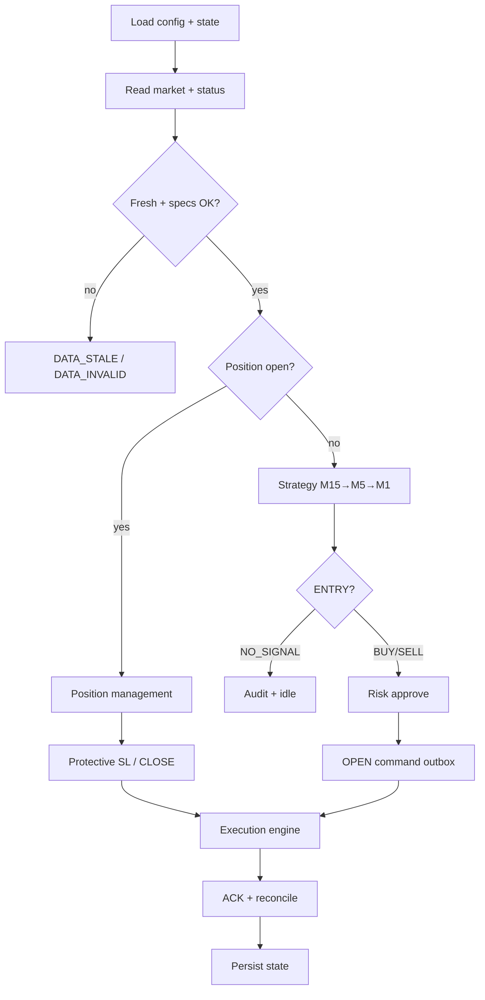

# SYSTEM Architecture V2 Plan

Target version: **2.0.0**  
Working branch: `rewrite/v2-clean-system`  
Legacy snapshot: `legacy-v1-final` / `archive/legacy-v1`

## Problems in V1 (why rewrite)

1. Entry from relative BUY/SELL scores instead of a concrete multi-TF setup.
2. WAIT / signal-quality / cooldown layers obscured NO_SIGNAL.
3. Oversized `cycle.py` and intertwined analysis/AI/execution.
4. Overwrite-style control/ack files without sequenced message IDs.
5. Config with live account numbers in-repo.
6. M1-only market export while strategy needs M15→M5→M1.
7. Trailing confirmation bugs historically used requested SL as broker proof (fixed late in v1.1.9; redesigned cleanly in v2).
8. Parallel docs/scripts/engines made ownership unclear.

## V2 design principles

- Live MT4 production runtime (tests use mocks only).
- Deterministic, typed domain models; reason codes for every rejection.
- Broker state is truth; ACK applied levels required for MODIFY confirm.
- One strategy first: `TREND_PULLBACK_BREAK`.
- No mandatory trade cooldown; only duplicate setup identity blocks.
- BE net +0.20 then 3.0-pip grid; high lock + exit pressure for open positions.
- Atomic JSON bridge under `runtime/bridge/`.

## Package map

```
src/checktrader/
  application/   live loop, cycle orchestration, health
  domain/        enums, models, money, errors
  config/        load + validate
  market_data/   load, validate, aggregate M1→M5/M15, indicators
  strategy/      trend_pullback setup engine + fingerprint
  risk/          lot, SL, margin
  position_management/  BE, pip grid, high lock, exit pressure
  execution/     commands, outbox, ACK, reconciliation
  state/         persistence + recovery
  observability/ logging, audit, reason codes
  dashboard/     simple local UI snapshot
```

## Cycle (high level)



## MT4 protocol (v2 schema sketch)

Envelope on every message:

- `protocol_version` = `2.0.0`
- `message_type`
- `message_id` (UUID)
- `generated_at_utc`
- `source` (`mt4` | `python`)
- `sequence` (monotonic uint)

Dirs: `runtime/bridge/{market,status,commands,acknowledgements,archive}/`

Command file: `{sequence}_{command_id}.json`  
ACK file: `{sequence}_{command_id}.ack.json`

MODIFY SUCCESS only if re-`OrderSelect` applied SL matches requested within tolerance and improves protection.

Full field lists: `docs/MT4_PROTOCOL.md` (created with implementation).

## Legacy deletion plan (after v2 green)

| Legacy path | Replacement |
|-------------|-------------|
| `engine/**` | `src/checktrader/**` |
| `run_live.py` | `python -m checktrader` |
| `dashboard.py` | `checktrader.dashboard` |
| `mql4/**` | `mt4/**` (after compile + protocol tests) |
| `data/**` runtime trees | `runtime/**` (gitignored) |
| Root `.bat` clutter | `scripts/*.ps1` |
| Score/AI/signal_quality entry gates | setup engine + risk |
| Overlapping docs | `docs/*.md` v2 set |

Report file: `docs/legacy/LEGACY_DELETE_REPORT.md`

## Implementation commits (ordered)

1. archive + inventory (this doc set)
2. clean v2 project structure
3. typed domain + configuration
4. atomic MT4 bridge protocol
5. market data validation + aggregation
6. trend pullback setup engine
7. risk + order construction
8. execution state machine + reconciliation
9. BE+0.20 and 3-pip trailing
10. high lock + exit pressure
11. dashboard + audit logs
12. unit/integration/e2e tests
13. CI
14. remove replaced legacy files
15. live operation documentation

## Known constraints

- MetaEditor compile cannot run on Linux CI; protocol logic tested via fixtures + documented compile steps.
- Technical operability ≠ profitability guarantee.
- `allowed_account_numbers` empty is a live start configuration error.
